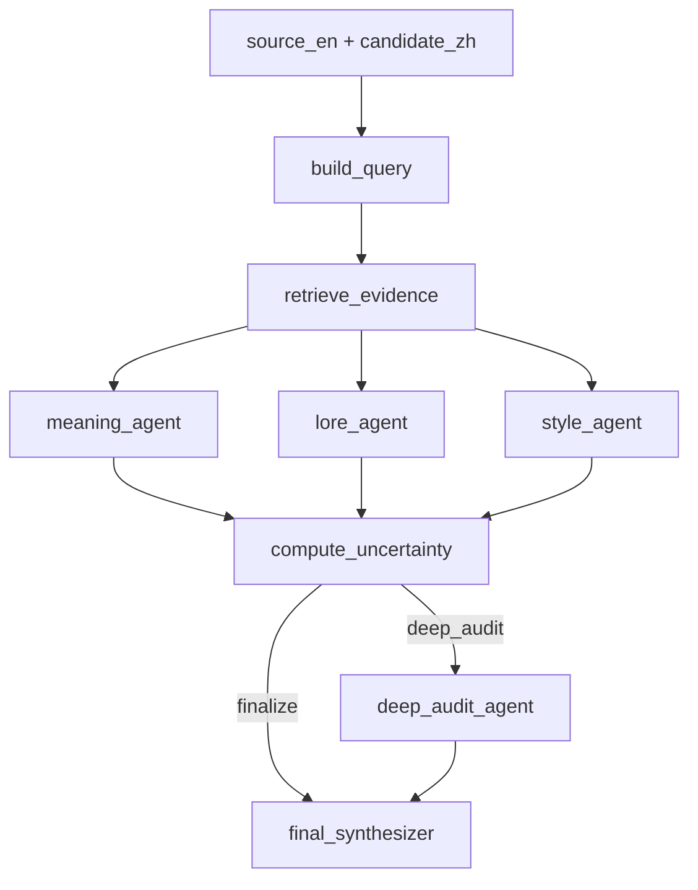

# LUNA RAG Architecture

This document describes the engineering structure for integrating the local lore vector database into a LangChain/LangGraph RAG evaluation workflow.

## Modules

- `luna/config.py`: shared paths and retrieval parameters.
- `luna/embeddings.py`: hash smoke-test embeddings and BGE-M3 adapter.
- `luna/retriever.py`: ChromaDB retrieval wrapper returning evidence IDs and metadata.
- `luna/deepseek_client.py`: DeepSeek Chat Completions client using `DEEPSEEK_API_KEY`.
- `luna/state.py`: LangGraph state schema.
- `luna/agents.py`: graph nodes for query building, retrieval, scoring, routing, and final synthesis.
- `luna/graph.py`: `StateGraph` assembly.
- `luna/cli_retrieve.py`: command-line retrieval smoke test.
- `luna/cli_evaluate.py`: command-line graph evaluation smoke test.

## Workflow



## Smoke Tests

Retrieve evidence:

```powershell
python -m luna.cli_retrieve "Bell Beast fast travel Pharloom"
```

Run one graph evaluation:

```powershell
python -m luna.cli_evaluate --sample-id demo --source-en "Defeat the Bell Beast" --candidate-zh "击败钟兽"
```

Run with DeepSeek:

```powershell
$env:DEEPSEEK_API_KEY="your_api_key"
python -m luna.cli_check_deepseek
python -m luna.cli_evaluate --sample-id demo --source-en "Defeat the Bell Beast" --candidate-zh "击败钟兽"
```

Run without LLM calls:

```powershell
python -m luna.cli_evaluate --sample-id demo --source-en "Defeat the Bell Beast" --candidate-zh "击败钟兽" --no-llm
```

Save a full state log:

```powershell
python -m luna.cli_evaluate --sample-id demo --source-en "Defeat the Bell Beast" --candidate-zh "击败钟兽" --save-log
```

Evaluate the survey sample dataset:

```powershell
python -m luna.batch_evaluate_survey --no-llm
```

Evaluate the first few rows as a smoke test:

```powershell
python -m luna.batch_evaluate_survey --limit 3 --no-llm --run-name smoke_test
```

Run with DeepSeek after setting the API key:

```powershell
$env:DEEPSEEK_API_KEY="your_api_key"
python -m luna.batch_evaluate_survey --run-name deepseek_full
```

Run a No-RAG baseline:

```powershell
python -m luna.batch_evaluate_survey --no-rag --run-name norag_deepseek_t045
```

Run BGE-M3 RAG with another routing threshold:

```powershell
python -m luna.batch_evaluate_survey --embedding-backend bge-m3 --routing-threshold 0.25 --run-name bge_m3_t025
```

## Next Integration Step

When `DEEPSEEK_API_KEY` is set, the preliminary agents use `deepseek-v4-flash` and the deep-audit node uses `deepseek-v4-pro`. If no key is present, the graph falls back to deterministic scaffold nodes for local testing.

The evaluation prompt now treats each translation candidate as a single standalone item. It receives the English source, one Chinese candidate, retrieved local evidence, and routing context, but it does not receive the other translation versions as contrastive context. This makes the workflow closer to a real localization audit setting where only one candidate translation may be available. Low-scoring or uncertain outputs include explicit low-score reasons, evidence feedback tied to retrieved database items, uncertainty reasons, and improvement suggestions in the CSV output.
